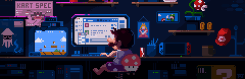

  

---

<h2 align="center">Hi there 👋, I'm Eben Ezer Tarigan!</h2>

  <b>💻 Information Systems Student | 🚀 Tech Enthusiast | 🎯 Lifelong Learner</b>

  Bandung, Indonesia

---

### 👨‍💻 About Me

- Currently studying Information Systems.
- Always excited to learn new technologies, especially in web development, data, and automation.
- I enjoy turning complex problems into simple, beautiful, and intuitive solutions.
- I love collaborating on open source projects and learning from the tech community.

---

###

  
  
  
  
  
  
  
  
  
  
  
  
  
  
  
  
  
  
  

###

  
  
  
  
  

###

  
  

###

<picture>
  <source media="(prefers-color-scheme: dark)" srcset="https://raw.githubusercontent.com/maurodesouz/maurodesouz/output/pacman-contribution-graph-dark.svg">
  <source media="(prefers-color-scheme: light)" srcset="https://raw.githubusercontent.com/maurodesouz/maurodesouz/output/pacman-contribution-graph.svg">
  
</picture>

###

  

###

  
  
  

###

  

###

### Fun Facts
- 📚 I enjoy reading about technology, psychology, and personal development.
- ☕ I believe a cup of coffee can solve (almost) any problem.

--- 
### Get In Touch 

🌐 My Personal Website : https://bentarigan.my.id/

---

  <b>Let's connect!</b>  
  <a href="mailto:ebentrgan@gmail.com">Email</a> |
  <a href="https://www.linkedin.com/in/ebenezertarigan/">LinkedIn</a>

